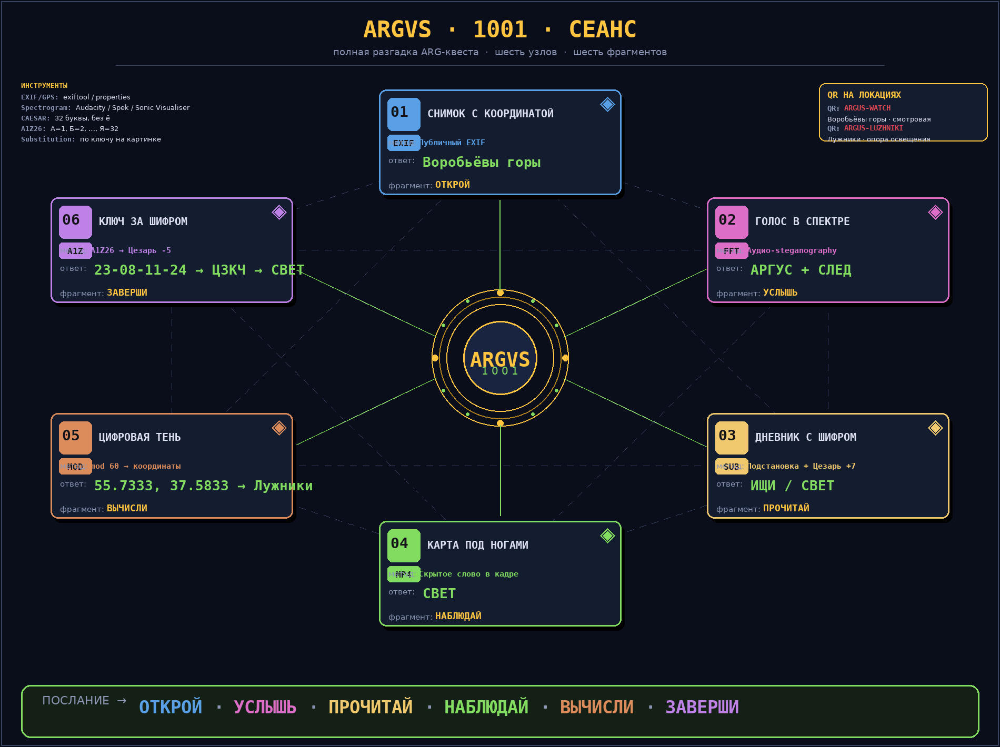

# ARG «Аргус-1001» — полная разгадка

> Краткое описание каждого узла с ответами, инструментами и подсказками для
> ведущего. Этот файл — для тебя (и для возможного соавтора в будущем);
> игрокам он не показывается.



---

## 0. Мост SIGame → Бот

```
zengame.siq ───► rename в .zip ───► открыть START.txt
                                          │
                              ┌───────────┴────────────┐
                              ▼                        ▼
                  Base64-блок №1               Base64-блок №2
                  (приветствие,                 «QVJHVVMxMDAx»
                   намёк «ищи ниже»)              →  ARGUS1001
                              │                        │
                              ▼                        ▼
                                         /start ARGUS1001
                                          в Telegram-боте
                                              │
                                              ▼
                                         prologue → …
```

- Полное сообщение (`tools/build_v5.py:quest_start_text()`) и `STARGAME2026 → ARGUS1001` вшиты в `zengame.siq` как два независимых Base64-блока. Случайно не забыть второй блок: первая строка приветствия содержит подсказку «ищи ключ ниже».
- `entry_code` в `bot/quest/stages.yaml` = **ARGUS1001**.
- `ENTRY_CODE` в `bot/.env` тоже должен быть **ARGUS1001** (или просто дефолт).
- После `/start ARGUS1001` бот шлёт приветствие и сразу ставит игрока на стадию **prologue** → **N1_intro**.

### Ожидания по нагрузке

- **Хранилище на неделю**: маленькая SQLite (`bot/quest.db`) + пара media-файлов; ничего больше.
- **Подсказки**: `bot/bot.py:cmd_hint` стоит **1 очко** за штуку; у нового игрока `banked == 0`. Начислять через `/addhint <@username или id> <n>` (`/addhint @kolya 3`).
- **Линейная цепочка**, нехаб. Все 6 узлов идут один за другим; хост только через `/setstage` переводит мимо (например, чтобы вытащить застрявшего).

---

## 1. Пролог — `prologue` (info)

Никаких задач, чисто атмосферный «СЕАНС ПЕРЕХВАЧЕН». Бот сам прокручивает
`next: N1_intro` после прочтения. Если бот завис на стартовом экране — это
нормально, ничего делать не надо.

---

## 2. Узел N1 — «Снимок с координатой»

### 2.1 Что происходит на сцене

| стадия      | mode  | данные от бота                                        | что делает игрок           |
|-------------|-------|--------------------------------------------------------|----------------------------|
| `N1_intro`  | info  | `n1_clue.jpg` (фото с зашитым EXIF GPS)                | читает                      |
| `N1_meta`   | info  | текст: где смотреть свойства файла                     | открывает свойства файла    |
| `N1_gps`    | info  | «открывай карту Москвы и езжай на точку»               | гуглит координаты           |
| `N1_place`  | auto  | «Где ты сейчас? Напиши название места»                  | вводит название             |
| `N1_on_site` | info | «Сканируй QR или введи код текстом»                     | достаёт код с локации       |
| `N1_qr`     | auto  | qr: `ARGUS-WATCH`                                      | вводит код                  |
| `N1_proof`  | approve | «Пришли фото с геометкой на фоне Воробьёвых гор»     | присылает фото → апрув      |
| `N1_fragment` | info |                                                            | «Запомни слово ОТКРОЙ»       |

### 2.2 Разгадка

- **Файл-источник**: `bot/quest/images/n1_clue.jpg` (сгенерирован `tools/make_quest_assets.py`).
- **EXIF GPS**: широта **55.7105° N**, долгота **37.5404° E** — ровно смотровая площадка Воробьёвых гор.
- **Ответ на `N1_place`**: одно из четырёх слов в `accept[]`: `Воробьёвы горы` / `ВОРОБЬЁВЫ ГОРЫ` / `Воробьевы горы` / `воробьевы горы`.
- **QR-код**: `ARGUS-WATCH` (генерится `bot/make_qr.py` в `bot/qr/N1_qr.png`). Распечатай и спрячь на лавке/ограждении ближе к восточному краю смотровой. На камеру телефона — работает.
- **APPROVE**: фото с включённой геометкой (`Настройки → Камера → Геотеги`), чтобы хост видел координаты в EXIF. Не примет скриншот карты.
- **Фрагмент**: **ОТКРОЙ**.

### 2.3 Подводные камни

- **Win и прочие платформы не показывают EXIF** по умолчанию — скажи игроку использовать `exiftool`, свойства Windows / macOS-«Просмотр», или онлайн-«EXIF viewer».
- Если игрок не включил геотеги при съёмке → попроси переснять. Скриншот карты не катит.
- Hint: «На фотографии видна смотровая площадка и панорама Москвы-реки».

---

## 3. Узел N2 — «Голос в спектре»

### 3.1 Что происходит

| стадия       | mode  | данные от бота                                                | что делает игрок           |
|--------------|-------|----------------------------------------------------------------|----------------------------|
| `N2_intro`   | info  | текст: «открой аудио в редакторе с просмотром спектрограммы»  | скачивает                  |
| `N2_audio1`  | info  | `audio: n2_audio1.wav` (5×7 пикс-шрифт → слово «АРГУС»)     | слушает / смотрит спектр   |
| `N2_word1`   | auto  | accept: `АРГУС` / `аргус` / `Аргус`                            | вводит слово                |
| `N2_audio2`  | info  | `audio: n2_audio2.wav` (другое слово)                          | анализирует                |
| `N2_word2`   | auto  | accept: `СЛЕД` / `след` / `След`                                | вводит слово                |
| `N2_fragment` | info |                                                                | «Запомни слово УСЛЫШЬ»       |

### 3.2 Разгадка

- **Генерация**: скрипт `tools/make_quest_assets.py` собирает 5×7 пиксельный кириллический шрифт (`PIXEL_FONT_5x7`) и **проецирует** букву на сетку `n_freq × n_time = 28 × (cols × time_per_pixel)`. Каждый «горящий» пиксель буквы = синусоида определённой частоты в определённый момент времени.
- **Файл `n2_audio1.wav` (4.0 с)**: слово **АРГУС**, в файле с частотой 600–6 500 Hz, шаг по частоте ≈ 215 Hz/строку, шаг по времени ≈ 30 мс/столбец.
- **Файл `n2_audio2.wav` (3.0 с)**: слово **СЛЕД** (4 буквы, покороче).
- **Прослушивание**: Audacity → вкладка «Spectrogram» / Spek drop / Voice-Audio-Analyser на android. Спектрограмма H × L, читается СЛЕВА НАПРАВО, низкие частоты — внизу.
- **Hint**: «спектrogram usually reads lower-left to upper-right».
- **Фрагмент**: **УСЛЫШЬ**.

### 3.3 Подводные камни

- **Качество спектрограммы зависит от FFT-настройки**. У большинства инструментов дефолт — норм; но в Audacity надо выставить `Window size ≥ 1024`, иначе пиксели склеятся в «кашу».
- Если у игрока нет Audacity и Spek, можно скинуть себе скриншотом через андроид-«Voice Audio Analyser» — там 5-секундный клип из Telegram тоже покатит.
- WAV-файлы тяжёлые (≈200 КБ); при желании можно сконвертить в mp3/opus. Спектр видим на любом формате.

---

## 4. Узел N3 — «Дневник с шифром»

### 4.1 Что происходит

| стадия       | mode  | данные от бота                          | что делает игрок           |
|--------------|-------|-----------------------------------------|----------------------------|
| `N3_intro`   | info  | `image: n3_page1.png`                    | читает дневниковую страницу |
| `N3_key`     | info  | инструкция по подстановке                | строит табличку ключа       |
| `N3_word1`   | auto  | accept: `ИЩИ` / `ищи` / `Ищи`             | вводит декодированное слово |
| `N3_page2`   | info  | `image: n3_page2.png` (Цезарь +7)        | читает страницу             |
| `N3_word2`   | auto  | accept: `СВЕТ` / `свет` / `Свет`          | вводит слово                |
| `N3_fragment` | info |                                         | «Запомни слово ПРОЧИТАЙ»    |

### 4.2 Разгадка

- **`n3_page1.png`**: подстановка по **фиксированному ключу**, сгенерированному в `make_quest_assets.py:make_n3_page1(seed=11)`. По сути — три строки текста с замещением по таблице В-С-З (32 буквы без ё). Целевое слово, выделенное красным — **`ИЩИ`**. На картинке внизу — полный ключ для расшифровки.
- **`n3_page2.png`**: Цезарь +7 по 32-буквенному алфавиту БЕЗ ё. Прямо:
  - `СВЕТ`:  С=18, +7=25=**Ш**; В=3, +7=10=**Й**; Е=6, +7=13=**М**; Т=19, +7=26=**Щ**
  - Значит зашифровано — **«ШЙМЩ»**. Игрок применяет −7 к каждой букве (по кругу того же 32-буквенного алфавита без ё) → получает слово **СВЕТ**.
- **Подсказка**: «русский алфавит БЕЗ Ё, 32 буквы, по кругу».
- **Фрагмент**: **ПРОЧИТАЙ**.

### 4.3 Подводные камни

- Ключ подстановки в `n3_page1.png` **записан мелким шрифтом** — если игрок не догадался прочитать, подскажи: «внизу страницы, мелким шрифтом, 32 ячейки вида А=Б».
- Если игрок пытается расшифровать страницу 2 обычной подстановкой по тому же ключу — не сходится, будет каша. Направь: «тут не подстановка, а сдвиг по кругу; цифра написана».
- Цезарь-сдвиг +7 не делай больше 31 (закольцовка). Проверь: в `n3_page2.png` под строкой должна стоять цифра «+7» в том же кадре.

---

## 5. Узел N4 — «Карта под ногами»

### 5.1 Что происходит

| стадия        | mode  | данные от бота                                | что делает игрок           |
|---------------|-------|-----------------------------------------------|----------------------------|
| `N4_intro`    | info  | текст про mp4-прогулку                        | готовится смотреть видео    |
| `N4_video`    | info  | `video: n4_walk.mp4`                          | смотрит, делает скриншоты  |
| `N4_capture`  | info  | «Что ты увидел?»                              | описывает                  |
| `N4_word`     | auto  | accept: `СВЕТ` / `свет` / `Свет`               | называет слово              |
| `N4_fragment` | info |                                                | «Запомни слово НАБЛЮДАЙ»   |

### 5.2 Разгадка

- **Файл**: `bot/quest/images/n4_walk.mp4`. Сейчас это **5-секундный чёрный плейсхолдер** (создан в `make_quest_assets.py:make_n4_placeholder`). Замени на свою 3–5 мин видео-прогулку по Москве.
- **Что должно быть в кадре**: в одном из кадров (1–2 сек) — крупная надпись **«СВЕТ»** (красным или жёлтым) на любом носителе (вывеска, стена, асфальт, граффити, объект). Слово сложно перепутать с окружением.
- **Подсказка**: «пролистай видео покадрово. Слово вспыхивает на 1–2 секунды».
- **Фрагмент**: **НАБЛЮДАЙ**.

### 5.3 Подводные камни

- **плейсхолдер гонять нельзя**: бот отдаёт чёрный экран, у игрока ступор. Положи настоящий файл до старта.
- Telegram поддерживает MP4 как `video` (показывает плеер + кадры). Если файл больше 50 МБ — лучше сжать (например, `ffmpeg -i n4_walk_raw.mp4 -crf 24 -preset slow n4_walk.mp4`).
- Звук в видео не важен; его лучше убрать ( `-an` опция ffmpeg) — лишний риск автоцензуры.

---

## 6. Узел N5 — «Цифровая тень»

### 6.1 Что происходит

| стадия       | mode  | данные от бота                                | что делает игрок           |
|--------------|-------|------------------------------------------------|----------------------------|
| `N5_intro`   | info  | `image: n5_table.png` (ЧАСЫ/МИНУТЫ/СЕКУНДЫ)    | смотрит таблицу            |
| `N5_method`  | info  | формула: 55.+((H·60+M)/3600), 37.+((H₂·60+S₂)/3600) | считает                    |
| `N5_decoded` | auto  | accept: `55.7333, 37.5833` (3 варианта запятой/пробела) | вводит координаты |
| `N5_arrived` | info  | «это Лужники, найди QR»                      | едет на локацию            |
| `N5_qr`      | auto  | qr: `ARGUS-LUZHNIKI`                          | вводит код                  |
| `N5_fragment` | info |                                                | «Запомни слово ВЫЧИСЛИ»    |

### 6.2 Разгадка

- **Таблица** (генерится `make_quest_assets.py:make_n5_table`):

    |      | ЧАСЫ | МИНУТЫ | СЕКУНДЫ |
    |------|------|--------|---------|
    | 1 стр | 44 | 00 | 00 |
    | 2 стр | 35 | 00 | 00 |

- **Широта** (первая строка):  55 + (44·60 + 00) / 3600 = 55 + 2640/3600 = 55.7333
- **Долгота** (вторая строка): 37 + (35·60 + 00) / 3600 = 37 + 2100/3600 = 37.5833
- **Место**: Лужники (спортивный комплекс), южная часть центральной аллеи.
- **QR-код**: `ARGUS-LUZHNIKI`. Распечатай и приклей на опору освещения (не главная сцена).
- **Подсказка**: «часы — двузначные числа от 00 до 23. Считай внимательно».
- **Фрагмент**: **ВЫЧИСЛИ**.

### 6.3 Подводные камни

- Игрок может перепутать ЧАСЫ/МИНУТЫ/СЕКУНДЫ. Подсказка в `N5_method` явно говорит, какие числа откуда берутся.
- Игрок может прочесть 37.5833 → 37.5850 (опечатка на 1 цифру). В `accept[]` есть только три конкретных написания — это сознательно узко, см. `_norm` в `quest.py` (формат `lat, lon` с возможной запятой/пробелом между).
- QR должен выдержать 1–2 недели на улице: ламинируй или используй стикер-винил.

---

## 7. Узел N6 — «Ключ за шифром»

### 7.1 Что происходит

| стадия       | mode  | данные от бота                       | что делает игрок           |
|--------------|-------|---------------------------------------|----------------------------|
| `N6_intro`   | info  | `image: n6_cipher.png` (цепочка)      | смотрит цепочку           |
| `N6_res1`    | auto  | accept: `ЦЗКЧ` / `цзкч`                | переводит числа в буквы     |
| `N6_step2`   | info  | подсказка про Цезарь                  | отнимает 5                  |
| `N6_res2`    | auto  | accept: `СВЕТ` / `свет` / `Свет`       | вводит итог                 |
| `N6_fragment` | info |                                       | «Запомни слово ЗАВЕРШИ»    |

### 7.2 Разгадка

- **Картинка** `n6_cipher.png`: одна строка «23-08-11-24» + шпаргалка про алфавит и сдвиг.
- **Прямой ход**: 23-08-11-24 — это **позиции букв** в 32-буквенном русском алфавите БЕЗ Ё (А=1). Расшифровка → ЦЗКЧ.
- **Обратный ход**: ЦЗКЧ — это результат **Цезаря +5** от исходного слова. Чтобы вернуть → −5 по кругу:
  - Ц(23)−5=18=С; З(8)−5=3=В; К(11)−5=6=Е; Ч(24)−5=19=Т → **СВЕТ**.
- **Подсказка**: всё расписано на самой картинке (прозрачный шрифт + бумага).
- **Фрагмент**: **ЗАВЕРШИ**.

### 7.3 Подводные камни

- **Алфавит — 32 буквы БЕЗ Ё**. Если игрок считает по 33-буквенному (с ё), он получит мусор. В `N6_res1:hint` и на самой картинке это написано явно.
- После Я=32 идёт А=1 (по кругу). Сдвиг `−5` от А(1) даёт **У**(32). Аналогично от Б(2) даёт Х(22) и т.д. Поскольку мы работаем с позициями 23/8/11/24, всё в пределах 1..32, −5 не закольцовывается.
- Цепочка «прибавляет» при прямом кодировании (читается вперёд) и «отнимает» при декодировании (читается назад). Это может сбить с толку, если игрок изначально угадал только «A1Z26» и не понял, что дальше ещё Цезарь.

---

## 8. Финал

```text
┌────────────────────────────────────────────────────────────────┐
│  ARGVS-1001 · СЕАНС ЗАВЕРШЁН                                  │
└────────────────────────────────────────────────────────────────┘

Шесть фрагментов сложились в послание:

   ОТКРОЙ · УСЛЫШЬ · ПРОЧИТАЙ · НАБЛЮДАЙ · ВЫЧИСЛИ · ЗАВЕРШИ
```

Это **mode: finish**, финальная стадия. Бот показывает текст, не отправляет ничего
ведущему (маркер `FINISH_HOST` шлётся в личку ведущему один раз).

### Что дальше делает игрок

Скриншотит, постит в чат друзьям, показывает ведущему. На этом квест
**индивидуально завершён** — бот больше не шлёт ему стадии.

---

## 9. Сводка ответов

| узел | метод                 | разгадка                                           | фрагмент |
|------|-----------------------|----------------------------------------------------|----------|
| **N1** | EXIF GPS              | `n1_clue.jpg` → Воробьёвы горы (55.7105, 37.5404), QR `ARGUS-WATCH`, фото-апрув | ОТКРОЙ |
| **N2** | Аудио-спектрограмма   | `n2_audio1.wav` → АРГУС, `n2_audio2.wav` → СЛЕД                  | УСЛЫШЬ |
| **N3** | Подстановка + Цезарь+7 | `n3_page1.png` (ключ seed=11) → ИЩИ; `n3_page2.png` → СВЕТ       | ПРОЧИТАЙ |
| **N4** | Скрытое слово в кадре  | замени `n4_walk.mp4` реальной прогулкой, в кадре мелькает «СВЕТ» | НАБЛЮДАЙ |
| **N5** | mod-60 → координаты   | (44, 35) из таблицы → 55.7333, 37.5833 (Лужники), QR `ARGUS-LUZHNIKI` | ВЫЧИСЛИ |
| **N6** | A1Z26 → Цезарь -5     | 23-08-11-24 → ЦЗКЧ → СВЕТ                                         | ЗАВЕРШИ |

**Послание**: `ОТКРОЙ · УСЛЫШЬ · ПРОЧИТАЙ · НАБЛЮДАЙ · ВЫЧИСЛИ · ЗАВЕРШИ`.

---

## 10. Чеклист ведущего перед стартом

- [ ] `bot/.env` заполнен: `BOT_TOKEN`, `HOST_ID`, `BOT_USERNAME`, `ENTRY_CODE=ARGUS1001`, опционально `PROXY`
- [ ] `bot/quest.db` пуста/свежая (`.delete` если прошлый прогресс надо сбросить)
- [ ] Python: `pip install -q -r bot/requirements.txt --break-system-packages` (среда сбрасывается между ходами)
- [ ] **QR-коды** распечатаны: `cd bot && BOT_TOKEN=x HOST_ID=1 BOT_USERNAME=your_bot python3 make_qr.py` → два файла в `bot/qr/`
- [ ] **QR `ARGUS-WATCH`** приклеен на смотровой Воробьёвых гор (восточный край, рядом с табличкой)
- [ ] **QR `ARGUS-LUZHNIKI`** приклеен в Лужниках (опора освещения рядом с центральной аллеей)
- [ ] `bot/quest/images/n4_walk.mp4` **заменён** на реальную видео-прогулку
- [ ] `zengame.siq` скопирован игрокам (или выложен; внутри живёт Base64-цепочка)
- [ ] Бот запущен: `cd bot && python3 bot.py` — в консоли появится `Бот @your_bot запущен. HOST_ID=…`
- [ ] Игроки знают, что `final_photo.png` в пакете — это «дверь в бота», а подсказки в SIGame зарабатываются через `/addhint`

## 11. Команды ведущего (напоминалка)

```text
/addhint @username n    — начислить n подсказок игроку
/sethint @username n    — выставить точный баланс
/setstage uid stage_id  — перевести игрока на любую стадию
/reset uid              — сбросить игрока в начало
/show stages            — выгрузить стадии (см. bot/quest.py)
/pending                — очередь на апрув
/approve uid / /reject  uid [причина]
/stats                  — кто на какой стадии
/broadcast <текст>       — сообщение всем
/help                   — справка (своя, HOST)
```

И последняя команда — `/id` — покажет `user_id` текущего диалога и
сверит его с `HOST_ID` из .env. Полезно для дебага прав.
